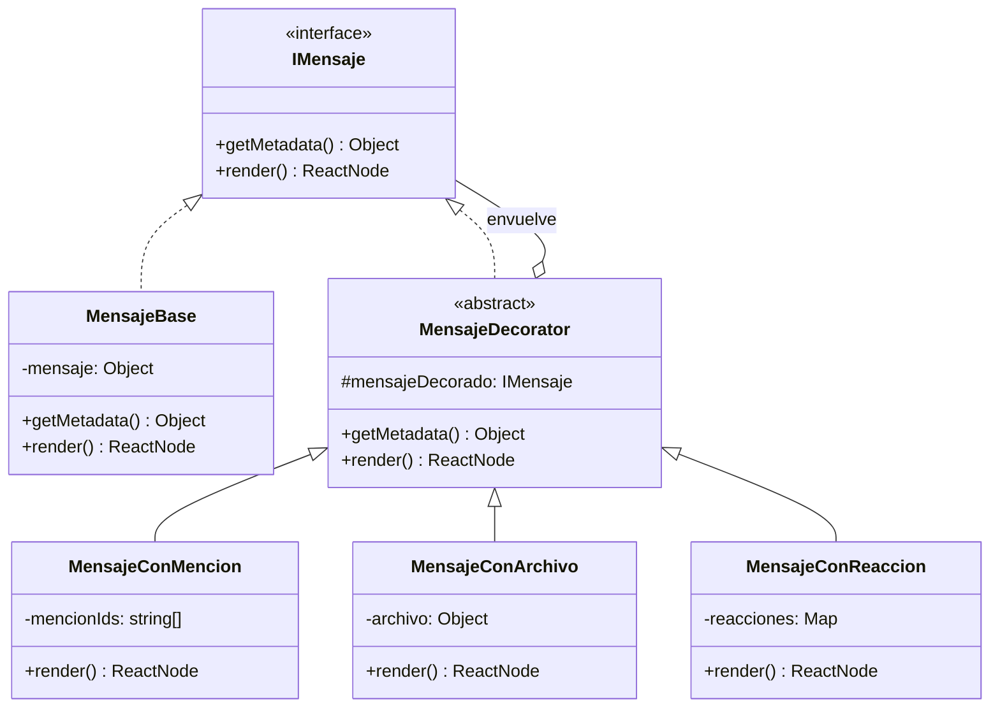

# Chat Service - Arquitectura de Mensajería (Patrón Decorator)

Este módulo implementa el **Patrón Decorator** para la gestión y renderizado de mensajes. Esta elección arquitectónica permite extender las funcionalidades de un mensaje (menciones, archivos adjuntos, reacciones) de manera dinámica y componible sin necesidad de modificar la clase base de mensajes.

## 1. Descripción del Patrón

El patrón Decorator se utiliza para añadir responsabilidades a objetos de forma dinámica. En nuestro sistema de chat, un mensaje puede ser simplemente texto, pero también puede tener metadatos adicionales que requieren un comportamiento o renderizado especial.

### Componentes Clave:
- **IMensaje (Interfaz/Abstracta)**: Define la estructura básica que todo mensaje debe seguir (getMetadata, render).
- **MensajeBase (Componente Concreto)**: La implementación básica que contiene el texto del mensaje.
- **MensajeDecorator (Decorador Base)**: Mantiene una referencia a un objeto `IMensaje` y delega las operaciones a él.
- **Decoradores Concretos**: 
    - `MensajeConMencion`: Resalta usuarios mencionados en el texto.
    - `MensajeConArchivo`: Añade la lógica de visualización y descarga de adjuntos.
    - `MensajeConReaccion`: Gestiona el mapa de emojis y contadores.

## 2. Diagrama de Clases (UML)



## 3. Componibilidad y MensajeFactory

La potencia de esta arquitectura reside en que los decoradores son **componibles**. Un mensaje puede ser envuelto múltiples veces para combinar funcionalidades. 

La `MensajeFactory` es la encargada de orquestar este orden de envoltura:

```typescript
// Ejemplo de composición en MensajeFactory
let mensaje = new MensajeBase(rawMessage);

if (rawMessage.hasMention) {
    mensaje = new MensajeConMencion(mensaje, rawMessage.mentions);
}

if (rawMessage.fileUrl) {
    mensaje = new MensajeConArchivo(mensaje, rawMessage.fileMetadata);
}

if (rawMessage.reacciones) {
    mensaje = new MensajeConReaccion(mensaje, rawMessage.reacciones);
}

// Al llamar a mensaje.render(), se ejecuta la cadena:
// Reaccion(Archivo(Mencion(Base)))
```

### Ventajas de esta implementación:
1. **Principio de Responsabilidad Única**: Cada decorador solo sabe gestionar su funcionalidad específica.
2. **Principio de Abierto/Cerrado**: Podemos añadir un nuevo tipo de mensaje (ej. `MensajeConEncuesta`) creando un nuevo decorador sin tocar el código existente.
3. **Orden de Renderizado**: Permite controlar exactamente si un elemento se dibuja "dentro" o "fuera" del contenido base.

---
*Documentación generada para el equipo de desarrollo de UniConnect G3.*
